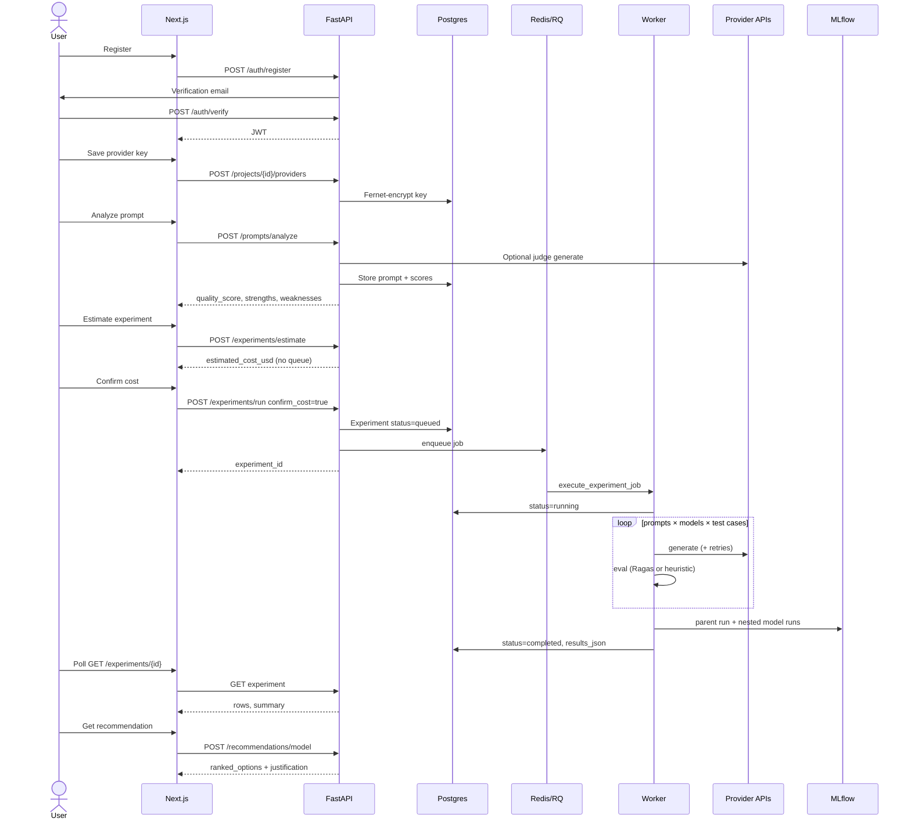

# Optiq

AI Configuration Advisor — paste a prompt, benchmark models under cost / latency / quality constraints, and get a ranked configuration before you ship. Experiments run off the HTTP request (RQ + Redis) and are logged to MLflow.

BYOK for OpenAI, Anthropic, and Gemini. Ollama is local / self-host only.

**Docs:** [PRD](./Optiq_PRD_v1.md)
**Source:** [github.com/SlothT/optiq-ai-configuration-advisor-](https://github.com/SlothT/optiq-ai-configuration-advisor-)

| Surface | URL (Docker Compose) |
|---|---|
| App | http://localhost:3001 |
| API | http://localhost:8000 |
| Swagger | http://localhost:8000/docs |
| MLflow | http://localhost:5000 |
| Mailpit (signup mail) | http://localhost:8025 |
| Health | http://localhost:8000/health |

`GET /health` and `GET /api/v1/models` need no credentials. Everything else is JWT (`Authorization: Bearer`). Registering requires working mail (local Mailpit, or SMTP / Resend in hosted).

Experiments are queued, not run inside the request. If a run stays `queued`, Redis or the worker is down. If Redis is missing, the API falls back to an in-process thread (`rq_job_id: "inline"`) — fine for a laptop, not for Render.

Hosted layout (Phase 5 blueprint in `render.yaml` + `frontend/vercel.json`): **Vercel** (Next.js) + **Render** (API + optional worker) + **Neon** Postgres + **Upstash** Redis. Set `NEXT_PUBLIC_API_URL` at Vercel **build** time. Set `FRONTEND_URL` on Render to the Vercel origin. Render free web services sleep after ~15 minutes; first hit can take ~50s. A free-tier worker may never stay up — use a paid worker or a VPS for long jobs. Do not deploy default `.env.example` secrets.

## Features

- Email + password signup with 24h verification (SMTP or Resend); optional Google ID-token sign-in
- Projects as the isolation unit — prompts, keys, experiments, recommendations
- Provider keys encrypted at rest (Fernet); Ollama stores a base URL, not a key
- Prompt Analyzer: paste text and/or attach context files; rule score + optional LLM judge (`auto` picks a configured model)
- Experiment Runner: 2+ models (or `auto` expands up to 8 configured models), CSV/JSON test inputs, **Estimate cost** then confirm
- Async RQ worker (1h job timeout); status `queued` → `running` → `completed` | `failed`
- Eval: Ragas when an OpenAI key is present, else embeddings / token-overlap heuristics + exact match for SQL / classification
- Constraint-aware ranking: `highest_quality` | `cheapest` | `fastest` plus max cost / latency / min quality / structured JSON
- In-app dashboard + MLflow parent run with nested per-model runs and JSON artifacts
- YAML model registry (`backend/app/config/models.yaml`) — add OpenAI / Ollama / Anthropic / Gemini rows without code
- Adapters retry 429 / 5xx / timeouts (3 attempts, exponential backoff)

## Golden path

1. Register → open Mailpit (`:8025`) → click verify → sign in.
2. Settings: create a project; save an OpenAI (or Anthropic / Gemini) key and/or an Ollama URL.
3. Prompt Analyzer: paste a prompt, attach optional context files, choose a judge (or Auto), analyze, **Send to Experiment Runner**.
4. Experiment Runner: pick 2+ models (or Auto), paste test inputs (`input`, optional `reference_answer`, `context`), **Estimate cost**, confirm. Poll until `completed`.
5. Recommendations: pick the experiment, set a goal, rank configs. Dashboard / MLflow for the same run.

```
Register → verify email → project + BYOK
  → analyze prompt (judge or Auto)
  → estimate cost → confirm → RQ job
  → compare rows → recommend under constraints
  → MLflow artifacts
```

## Try it (Docker)

Requires [Docker Desktop](https://www.docker.com/products/docker-desktop/). Optional: [Ollama](https://ollama.com/) (`ollama pull llama3.2`).

```bash
cp .env.example .env
python -c "from cryptography.fernet import Fernet; print(Fernet.generate_key().decode())"
# Paste into FERNET_KEY. Also set JWT_SECRET to something long and random.
cd infra
docker compose up --build
```

App: http://localhost:3001 — Swagger: http://localhost:8000/docs

Compose publishes the frontend on **3001** (`3001:3000`). `npm run dev` without Docker is **3000**.

### Request — register

```bash
curl -X POST http://localhost:8000/api/v1/auth/register \
  -H 'Content-Type: application/json' \
  -d '{"email":"you@example.com","password":"letters1"}'
```

Password: ≥8 characters, letters **and** digits. Response is `201` with `email_verified: false`. Confirm via Mailpit, then login:

```bash
curl -X POST http://localhost:8000/api/v1/auth/login \
  -H 'Content-Type: application/json' \
  -d '{"email":"you@example.com","password":"letters1"}'
```

`{ "access_token": "<jwt>", "token_type": "bearer" }` — send as `Authorization: Bearer <jwt>`.

### Request — analyze (multipart)

```bash
curl -X POST http://localhost:8000/api/v1/prompts/analyze \
  -H "Authorization: Bearer $TOKEN" \
  -F project_id=<project_id> \
  -F task_type=open_ended \
  -F judge_model=gpt-4o-mini \
  -F text='Write a SQL query that returns unpaid invoices.' \
  -F files=@schema.md
```

Uploads are **context**, not the prompt. Empty `text` is `422`. Judge `auto` resolves to a configured model; if the judge call fails, analysis falls back to rules (`judge_model: "fallback"`).

### Response (trimmed)

```json
{
  "prompt_id": "a1b2c3…",
  "version": 1,
  "quality_score": 78.0,
  "strengths": ["Mentions a structured output or data format"],
  "weaknesses": ["No few-shot examples were found"],
  "suggested_improvements": ["Add one or two examples for edge cases"],
  "estimated_tokens": 42,
  "estimated_cost_usd": 0.000012,
  "cost_is_local": false,
  "judge_model": "gpt-4o-mini",
  "analysis_json": {}
}
```

### Request — estimate then run

```json
{
  "project_id": "<project_id>",
  "prompt_ids": ["<prompt_id>"],
  "model_ids": ["gpt-4o-mini", "llama3.2"],
  "task_type": "open_ended",
  "test_inputs": [
    {"input": "List unpaid invoices", "reference_answer": null, "context": null}
  ],
  "temperature": 0.2,
  "confirm_cost": false
}
```

`POST /api/v1/experiments/estimate` and `POST /api/v1/experiments/run` with `confirm_cost: false` return an estimate and **do not** enqueue. Set `confirm_cost: true` to queue.

`model_ids: ["auto"]` expands to up to 8 models from configured providers (Ollama tags from `/api/tags`). Mix Auto with explicit IDs — duplicates are dropped.

Status: `queued` | `running` | `completed` | `failed`. Poll `GET /api/v1/experiments/{id}`.

## Architecture

```
Browser ──HTTPS──▶ Next.js (Vercel or :3001)
                       │  Bearer JWT
                       ▼
                 FastAPI (:8000)
                       │
                       ├─ JWT + project ownership
                       ├─ Fernet decrypt provider keys
                       ├─ YAML model registry
                       ├─ AdapterFactory (OpenAI / Anthropic / Gemini / Ollama)
                       │       └── httpx + retries
                       ├─ estimate → 200 without queue
                       └─ run (confirmed) ──enqueue──▶ Redis / RQ
                                                       │
                                                       ▼
                                                 worker
                                                       ├─ generate × (prompts × models × cases)
                                                       ├─ eval (Ragas | embeddings | overlap)
                                                       ├─ MLflow parent + nested runs
                                                       └─ status completed | failed
```

### Experiment sequence



| Path | Role |
|---|---|
| `backend/app/main.py` | FastAPI app, CORS |
| `backend/app/api/` | Auth, projects, providers, prompts, experiments, recommendations, health |
| `backend/app/adapters/` | Provider HTTP + retry helper |
| `backend/app/config/models.yaml` | Models and USD / 1M-token pricing |
| `backend/app/services/phase1.py` | Analyzer, cost, experiment execution, ranking |
| `backend/app/services/evaluation.py` | Ragas / heuristic metrics, CSV/JSON test-input parse |
| `backend/app/services/auto.py` | `auto` judge + experiment expansion |
| `backend/app/workers/` | RQ enqueue; inline thread fallback |
| `backend/app/mlflow_integration/` | Tracking (failures are logged, never fail the job) |
| `frontend/app/` | App Router pages |
| `infra/docker-compose.yml` | Postgres, Redis, MLflow, Mailpit, API, worker, frontend |
| `render.yaml` | Render web + worker blueprint |

## Setup

**Docker** (above) is the supported full stack. Without Compose:

- Python **3.11+**, Node **20+**, Postgres 16, Redis 7, MLflow (or the `postgres` / `redis` / `mlflow` / `mailpit` services only)

```bash
cd infra
docker compose up postgres redis mlflow mailpit -d
```

**Backend**

```bash
cd backend
python -m venv .venv
# Windows: .venv\Scripts\activate
pip install -r requirements.txt
# DATABASE_URL, REDIS_URL, MLFLOW_TRACKING_URI, FERNET_KEY, JWT_SECRET, FRONTEND_URL, SMTP_* in repo-root .env
alembic upgrade head
uvicorn app.main:app --reload --port 8000
```

Worker (second terminal):

```bash
cd backend
rq worker --url redis://localhost:6379/0 default
```

**Frontend**

```bash
cd frontend
npm install
# NEXT_PUBLIC_API_URL=http://localhost:8000
npm run dev
```

UI: http://127.0.0.1:3000 — Swagger: http://127.0.0.1:8000/docs

| Env | Purpose |
|---|---|
| `DATABASE_URL` | SQLAlchemy Postgres URL |
| `REDIS_URL` | RQ queue |
| `MLFLOW_TRACKING_URI` | Tracking server; empty on Render if you skip MLflow |
| `JWT_SECRET` | Access-token signing (24h default) |
| `FERNET_KEY` | Encrypt provider API keys |
| `FRONTEND_URL` | CORS + verification-link origin |
| `SMTP_HOST` / `SMTP_PORT` / `SMTP_FROM` / `SMTP_USE_TLS` | Signup mail (Mailpit locally: host `mailpit`, port `1025`, TLS off) |
| `RESEND_API_KEY` | Hosted mail; tried before SMTP |
| `GOOGLE_CLIENT_ID` | Optional Google button (must match the token `aud`) |
| `OLLAMA_BASE_URL` | Default Ollama (`http://host.docker.internal:11434` from Docker Desktop) |
| `NEXT_PUBLIC_API_URL` | Browser API origin (baked in at Next **build**) |
| `NEXT_PUBLIC_MLFLOW_URL` | Dashboard deep-link |

Secrets only in `.env` / host dashboards — never in git. `.env.example` is a template.

## API

Prefix `/api/v1`. Auth column: **JWT** = `Authorization: Bearer`.

| Method | Path | Auth |
|---|---|---|
| GET | `/health` | None |
| GET | `/api/v1/health` | None |
| GET | `/api/v1/models` | None (registry dump) |
| POST | `/api/v1/auth/register` | None |
| POST | `/api/v1/auth/login` | None |
| POST | `/api/v1/auth/verify` | None (body `token`) |
| POST | `/api/v1/auth/resend-verification` | None |
| POST | `/api/v1/auth/google` | None (`id_token`; needs `GOOGLE_CLIENT_ID`) |
| GET | `/api/v1/auth/me` | JWT |
| GET / POST | `/api/v1/projects` | JWT |
| GET | `/api/v1/projects/{id}` | JWT + owner |
| GET / POST | `/api/v1/projects/{id}/providers` | JWT + owner |
| DELETE | `/api/v1/projects/{id}/providers/{name}` | JWT + owner |
| POST | `/api/v1/prompts/analyze` | JWT + owner (multipart) |
| GET | `/api/v1/prompts?project_id=` | JWT + owner |
| POST | `/api/v1/experiments/estimate` | JWT + owner |
| POST | `/api/v1/experiments/run` | JWT + owner; `confirm_cost` to enqueue |
| GET | `/api/v1/experiments?project_id=` | JWT + owner |
| GET | `/api/v1/experiments/compare?ids=` | JWT + owner |
| GET | `/api/v1/experiments/{id}` | JWT + owner |
| GET | `/api/v1/experiments/{id}/metrics` | JWT + owner |
| POST | `/api/v1/recommendations/model` | JWT + owner |

Errors use FastAPI `{ "detail": "…" }`. Common cases:

| Situation | HTTP |
|---|---|
| Invalid / missing JWT | 401 |
| Unverified email on password login | 403 |
| Duplicate register | 409 |
| Mail not configured / send failed | 503 |
| Redis down **and** enqueue path used (after inline fallback still fails) | 503 |
| Unknown prompt / experiment / project | 404 |
| Empty prompt text, missing models, bad password shape | 422 |
| Google not configured | 503 |

Providers: `openai`, `anthropic`, `google` (Gemini adapter), `ollama`. Cloud providers require `api_key` on upsert; Ollama requires a reachable base URL. Installed Ollama tags are listed even if they are not in YAML.

Task types used in the UI include `open_ended`, `sql_generation`, `classification`, `summarization`, `extraction`.

## Approach

- **Thin HTTP API** — FastAPI + SQLAlchemy + Alembic (`0001` core schema, `0002` auth provider, `0003` email verified).
- **Adapters, not SDKs in routes** — each provider implements `generate` / `health_check`; OpenAI also `embed`. Factory decrypts the project key at call time.
- **Cost before spend** — `estimate_experiment_cost` uses tiktoken (or a word heuristic) × YAML `input_per_1m` / `output_per_1m`. Ollama `pricing: null` → `$0` and `cost_is_local: true`.
- **Queue the grid** — `prompts × models × test cases` can be long; RQ job timeout 3600s. MLflow is best-effort.
- **Eval without a second billed judge when possible** — Ragas `answer_relevancy` / `faithfulness` if OpenAI is configured; otherwise cosine on embeddings or Jaccard overlap. SQL / JSON-looking references use exact match.
- **Recommendations are deterministic** — filter constraints, then weighted score. Honest copy when every row failed or quality and cost are both zero.
- **Auto is not magic** — judge Auto = last completed experiment’s top model, else a preferred list (`gpt-4o-mini`, `gpt-4o`, `llama3.2`, …). Experiment Auto = union of configured models, cap 8.

Stack: Python 3.11, FastAPI, Pydantic Settings, RQ, MLflow, Ragas, Next.js 14 App Router, Tailwind.

## Model registry

`backend/app/config/models.yaml` (pricing USD per 1M tokens):

| Provider | Models |
|---|---|
| OpenAI | `gpt-4o`, `gpt-4o-mini` |
| Ollama | `llama3.2`, `mistral`, `qwen2.5` (+ any pulled tag) |
| Anthropic | `claude-sonnet-4-20250514`, `claude-opus-4-20250514` |
| Google | `gemini-2.0-flash` |

New IDs for an existing adapter: YAML only. New vendor: add adapter + factory branch + YAML `adapter:` name.

## UI

| Route | Role |
|---|---|
| `/` | Overview |
| `/auth/register` `/auth/login` `/auth/verify` | Account |
| `/settings` | Project + provider keys |
| `/prompt-analyzer` | Analyze + send to runner |
| `/experiment-runner` | Estimate, run, compare |
| `/recommendations` | Rank under a goal |
| `/dashboard` | Recent experiments + MLflow link |

JWT lives in `localStorage` (`optiq_token`). Treat XSS like a stolen session.

## Limitations

- No billing, teams, or hosted “free” model keys — BYOK
- Ollama cannot run on Vercel / typical Render web dynos
- Ragas needs an OpenAI key on the **project**; otherwise metrics are local heuristics
- In-process experiment fallback has no persistence across API restarts
- MLflow logging can fail silently (job still completes)
- JWT in the browser is not httpOnly
- Decoration of eval quality is 0–100, not a published academic benchmark
- Render / Vercel sleep and build-time `NEXT_PUBLIC_*` are easy to misconfigure

## Security

- Password hashes: bcrypt. Verification tokens: hashed at rest, 24h TTL
- Provider secrets: Fernet; never returned in list payloads (`has_api_key` only)
- Project-scoped ownership on every mutating route
- CORS allow-list: `FRONTEND_URL` plus local `:3000` / `:3001`
- Mail credentials and `FERNET_KEY` / `JWT_SECRET` only in env
- Google: `tokeninfo` + `aud` must equal `GOOGLE_CLIENT_ID`; email must be verified

## Testing

No provider credentials required for unit tests:

```bash
cd backend
pip install -r requirements.txt
python -m pytest -q
python -m ruff check .
```

```bash
cd frontend
npm install
npm run lint
npm run build
```

CI (`.github/workflows/ci.yml`): backend ruff + pytest; frontend lint + `next build` on push / PR to `main`.
