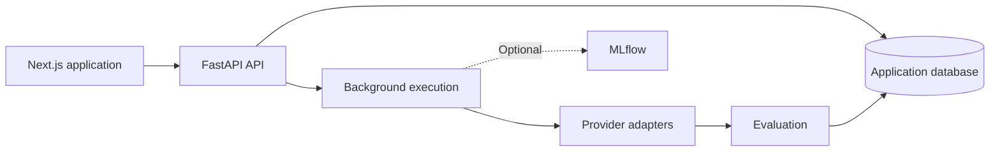

# Optiq

**Choose an affordable LLM for your prompt before you spend.**

Optiq provides prompt-first model advice: paste a task, get a suggested starting model and alternatives, understand the cost assumptions, and optionally compare outputs using your own provider access. No dataset, account, or provider key is required for advice.

The starter advisor uses inspectable local rules and a small curated registry. Suggestions are **predicted suitability, not verified model performance**. Supported advice covers routine writing, summarization, extraction, and classification; ambiguous or unsupported requests return an explanation instead of a confident winner.

Paid inference uses your own OpenAI, Anthropic, or Google Gemini API key. Local inference is available through Ollama. Local models have zero API charges, but their operating costs are not measured.

[Quick start](#quick-start) · [Architecture](#architecture) · [Development guide](docs/development.md) · [Contributing](CONTRIBUTING.md) · [Product requirements](Optiq_PRD_v1.md)

## Features

- **Model advice:** prompt-based shortlist, suitability reasons, assumptions, and limitations without paid advisory calls.
- **Cost comparison:** estimated API cost against an optional baseline, with versioned registry prices and source links.
- **Optional verification:** compare outputs after reviewing scope, maximum output tokens, and a per-experiment budget.
- **Honest evidence:** subjective work stays unscored for user review; deterministic reference checks are available for applicable tasks. No hidden paid judges or embedding calls.
- **Constraint handling:** excluded or failed configurations are not restored as winners; missing quality evidence remains explicit.
- **History and feedback:** retain outputs, failures, partial results, accounting, and user acceptance of an observed output.
- **Project isolation:** project-based history and encrypted provider credentials, with email verification and sign-in.
- **Optional tracking:** MLflow integration without making it a setup requirement.

## Quick start

### Requirements

- Linux or WSL2
- Python **3.11 or later**
- Node.js **20 or later**, with npm; Node.js 22 is specified in `.nvmrc`

The default development setup uses SQLite, local background jobs, and verification email files. Docker, Postgres, Redis, SMTP, and MLflow are optional for local development. Provider credentials are required only for live model requests.

### Installation

```bash
git clone https://github.com/SlothT/optiq-ai-configuration-advisor-.git
cd optiq-ai-configuration-advisor-

# Optional: select the project's Node.js version if you use nvm.
nvm install
nvm use

./scripts/optiq setup
./scripts/optiq dev
```

If the repository is already cloned, run the last two commands from its root directory. Omit the `nvm` commands when Node.js is managed another way.

The setup command creates the Python environment, installs dependencies, generates local secrets, and applies database migrations. Existing configuration files, secrets, and application data are preserved. The development command starts both services with automatic reload; **Ctrl+C** stops them.

| Service | Address |
|---|---|
| Web application | [localhost:3000](http://localhost:3000) |
| API documentation | [localhost:8000/docs](http://localhost:8000/docs) |
| API health | [localhost:8000/health](http://localhost:8000/health) |

### First advice and optional comparison

1. Open **Model Advisor**, paste your prompt, and select a cost/quality preference and expected output length.
2. Optionally select your current model as a cost baseline. Click **Suggest a model**; this makes no provider calls.
3. Review the explanation, pricing assumptions, and untested-status notice. Copy the prompt and settings for use elsewhere.
4. To test outputs, register/sign in, open the verification link in `.local/mail/*.eml`, and create a project in **Settings**.
5. Configure only the providers you want to test. For Ollama, ensure a selected model is installed and reachable.
6. Return to **Model Advisor** and choose **Prepare optional test**. The suggested model and optional baseline carry into **Experiment Runner**.
7. Review model selection, output-token limits, and estimated reservation. Set a budget and confirm execution explicitly.
8. Compare each output and mark whether it meets your need. Feedback applies to that observed output, not general model reliability.

Advice and saved prompt review use local rules. Automated tests use provider fixtures and do not require paid keys.

### Cost and budget behavior

Each experiment has its own budget. Before queueing, Optiq reserves the complete displayed estimate; a budget below that estimate is rejected. Reduce the comparison scope or output limit to fit a smaller budget. The worker persists a reservation before each call, retains unresolved failed-call charges, and stops new work if the remaining amount cannot cover another call. An atomic worker claim prevents duplicate dispatch of the same experiment.

Experiment generation uses one attempt per call: automatic retries and paid evaluators are disabled. Estimates include maximum output tokens and an input-token buffer. These are dispatch controls, **not a guarantee of the final provider invoice**; missing usage, in-flight work, and pricing differences remain possible. Advice costs zero API spend; optional testing can cost more than a one-off model switch saves.

Prices are standard text API snapshots, not subscription-credit conversions. Consult the registry's source/date fields and refresh them as providers change models or rates. Unknown paid pricing is rejected. Local operating costs, tools, caching discounts, and plan-specific allowances are not modeled. See [advisor behavior](docs/model-advisor.md) for the current rules and limitations.

## Architecture


```mermaid
flowchart LR
    UI[Next.js application] --> API[FastAPI API]
    API --> DB[(Application database)]
    API --> Jobs[Background execution]
    Jobs --> Providers[Provider adapters]
    Providers --> Evaluation[Evaluation]
    Evaluation --> DB
    Jobs -. Optional .-> Tracking[MLflow]
```

| Component | Technology |
|---|---|
| Frontend | Next.js, React, TypeScript, Tailwind CSS |
| API | FastAPI, Pydantic, SQLAlchemy |
| Database migrations | Alembic |
| Native development database | SQLite |
| Deployment database | Postgres |
| Job execution | Local development threads or Redis/RQ |
| Provider integrations | OpenAI, Anthropic, Gemini, Ollama |
| Evaluation | Deterministic reference checks and user review |
| Optional tracking | MLflow |

Local thread jobs require `DEBUG=true` and are interrupted by API reloads or restarts. Use Postgres and Redis/RQ when validating persistent queues, concurrency, or deployment behavior.

### Repository structure

```text
backend/
  app/api/                 HTTP endpoints and access control
  app/adapters/            Provider integrations
  app/services/            Analysis, evaluation, and ranking
  app/workers/             Experiment dispatch and execution
  app/config/models.yaml   Model registry and pricing
  alembic/                 Database migrations
  tests/                   Unit and integration tests
frontend/                  Next.js application
infra/                     Compose configuration and database initialization
scripts/                   Contributor setup and development commands
docs/                      Development guide and repository review
```

## Development commands

Run these commands from the repository root:

| Command | Purpose |
|---|---|
| `./scripts/optiq setup` | Install/update dependencies and apply migrations |
| `./scripts/optiq dev` | Start the frontend and API |
| `./scripts/optiq doctor` | Check runtime configuration and database connectivity |
| `./scripts/optiq check` | Run backend lint/tests and frontend lint/type checks |
| `./scripts/optiq check --build` | Also verify the frontend production build |
| `./scripts/optiq setup --extras` | Install optional tracking/legacy evaluation dependencies |
| `./scripts/optiq compose up --build` | Start the Postgres/RQ integration stack |

To select alternative local ports:

```bash
./scripts/optiq dev --api-port 8100 --web-port 3100
```

The launcher updates the API and verification-link origins for that session. See the [development guide](docs/development.md) for Compose, optional tracking, configuration details, and troubleshooting.

## Configuration

Setup generates a private root `.env` and `frontend/.env.local`. The template contains placeholders; use the setup command to generate valid secrets instead of copying it unchanged.

| Setting | Purpose |
|---|---|
| `DATABASE_URL` | Application database connection |
| `JOB_BACKEND` | `thread` for native development; `rq` for Redis-backed execution |
| `MAIL_BACKEND` | `file` for local verification messages; `smtp` for SMTP/Resend delivery |
| `JWT_SECRET` | Access-token signing secret |
| `FERNET_KEY` | Encryption key for stored provider credentials |
| `FRONTEND_URL` | CORS and email verification-link origin |
| `MLFLOW_TRACKING_URI` | Optional tracking server; empty disables logging |
| `OLLAMA_BASE_URL` | Ollama server endpoint |
| `NEXT_PUBLIC_API_URL` | Frontend API origin |

Native database, mail, and optional tracking data are stored under `.local/`. Back up the database and `.env` together: replacing the Fernet key prevents decryption of existing provider credentials. Configuration files and local data are excluded from version control.

## API

The API uses the `/api/v1` prefix. Health endpoints, prompt advice (`POST /api/v1/advice`), and the model registry are public. Project resources require a bearer JWT and enforce ownership checks.

Core resources include authentication, projects, providers, prompts, experiments, and recommendations. Interactive schemas and request examples are available at [Swagger UI](http://localhost:8000/docs) while the API is running.

Experiments require explicit confirmation before execution and report `queued`, `running`, `completed`, `budget_stopped`, or `failed` status.

## Project status

Optiq is under active development. The prompt-first advisor is a rules-based starting point awaiting user/provider validation; it is not a trained router. Budget controls limit dispatch using estimates, not provider billing. Dataset-based regression tooling and production routing remain future work.

The [repository review](docs/repository-review.md) documents current correctness gaps, including reference-answer leakage, omitted recommendation constraints, and incomplete evaluation cost accounting. These issues should be resolved before using experiment rankings for production decisions.

## Contributing

See [CONTRIBUTING.md](CONTRIBUTING.md) for the contributor workflow. CI validates the native setup, application checks, Compose configuration, and Postgres migration upgrades/downgrades.

