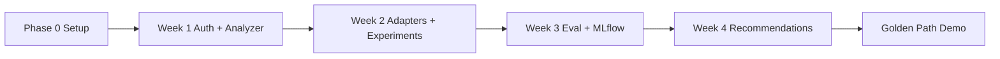

# Optiq — Build Planner

**Source of truth:** [Optiq_PRD_v1.md](./Optiq_PRD_v1.md)  
**Owner:** Toshi Srivastava  
**Last Updated:** 2026-08-02  
**MVP Target:** 4 weeks (Phase 0 + Phase 1)

---

## How to use this doc

1. Work **top to bottom** within each phase — later tasks depend on earlier ones.
2. Check boxes `[ ]` → `[x]` as you complete tasks.
3. Each task maps to PRD sections (FR = Functional Requirement, NFR = Non-Functional Requirement).
4. **Definition of Done (DoD)** at the end of each week must pass before moving on.
5. Deferred items are listed in **Backlog (v2+)** — do not build them during MVP.

---

## Golden path demo (MVP success)

The MVP is done when this flow works end-to-end:

```
Register → Login → Create project → Add OpenAI key + Ollama URL
  → Analyze prompt (user-selected judge model)
  → Run 3-model experiment (with test inputs + cost confirmation)
  → View results in comparison table
  → Get model recommendation from experiment
  → Browse runs in MLflow dashboard (+ link to native MLflow UI)
```

---

## Task overview

| Phase | Timeline | Goal |
|---|---|---|
| **Phase 0** | Week 0 (2–3 days) | Repo, infra, CI — everything runs locally via Docker |
| **Phase 1 — Week 1** | Days 1–7 | Auth, projects, provider keys, Prompt Analyzer |
| **Phase 1 — Week 2** | Days 8–14 | Model adapters, Experiment Runner, async jobs |
| **Phase 1 — Week 3** | Days 15–21 | Ragas evaluation, MLflow logging, dashboard v1 |
| **Phase 1 — Week 4** | Days 22–28 | Recommendation engine, Auto mode, polish + demo |
| **Phase 2+** | Week 5+ | RAG, DeepEval, hardening — see Backlog |



---

## Phase 0 — Project setup (Week 0)

**Goal:** Monorepo scaffolded; all services start with `docker compose up`.

### 0.1 Repository & structure
- [ ] Create monorepo folder structure per PRD Section 19
- [ ] Add root `README.md` with setup instructions
- [ ] Add `.gitignore` (Python, Node, `.env`, secrets)
- [ ] Add `.env.example` with required env vars (DB URL, JWT secret, Fernet key, MLflow URI)

### 0.2 Infrastructure (Docker Compose)
- [ ] `infra/docker-compose.yml`: PostgreSQL, Redis, MLflow tracking server
- [ ] `mlflow/docker-compose.mlflow.yml` or merge into main compose
- [ ] Verify Postgres accepts connections; MLflow UI reachable (default `:5000`)
- [ ] Verify Redis reachable for RQ

**PRD refs:** Section 9 (Architecture), Section 18 (Tech Stack), Section 14 (MLflow)

### 0.3 Backend skeleton
- [ ] FastAPI app in `backend/app/main.py` with health check `GET /health`
- [ ] SQLAlchemy (or SQLModel) + Alembic migrations setup
- [ ] Pydantic settings loader (`DATABASE_URL`, `MLFLOW_TRACKING_URI`, etc.)
- [ ] `requirements.txt` with pinned core deps (fastapi, uvicorn, sqlalchemy, alembic, redis, rq, mlflow, ragas, httpx, bcrypt, python-jose, cryptography)

### 0.4 Frontend skeleton
- [ ] Next.js App Router project in `frontend/`
- [ ] Tailwind CSS configured
- [ ] Base layout: nav shell with placeholder routes (auth, prompt-analyzer, experiment-runner, recommendations, dashboard, settings)
- [ ] API client helper in `frontend/lib/api.ts` pointing to backend

### 0.5 Model registry config
- [ ] Create `backend/app/config/models.yaml` with initial models + pricing
  - OpenAI: `gpt-4o`, `gpt-4o-mini`
  - Ollama: `llama3.2`, `mistral`, `qwen2.5`
  - Placeholder entries for Anthropic/Gemini (wire in Week 2)
- [ ] Loader module to parse YAML and expose model list + pricing

**PRD refs:** FR7.3, FR6.4, NFR3

### 0.6 CI skeleton
- [ ] GitHub Actions: lint + type-check backend; lint frontend
- [ ] Optional: run backend unit tests on push

### Phase 0 — Definition of Done
- [ ] `docker compose up` starts Postgres, Redis, MLflow, backend, frontend without errors
- [ ] `GET /health` returns 200
- [ ] Frontend loads placeholder pages
- [ ] `models.yaml` loads and lists models

---

## Phase 1 — Week 1: Auth, projects, provider keys, Prompt Analyzer

**Goal:** User can register, log in, create a project, store keys, and analyze a prompt.

### 1.1 Database migrations
- [ ] Migration: `users` table (PRD Section 12)
- [ ] Migration: `projects` table
- [ ] Migration: `provider_keys` table (encrypted key + ollama_base_url)
- [ ] Migration: `prompts` table (with `judge_model`, `version`)

**PRD refs:** Section 12

### 1.2 Authentication (backend)
- [ ] `POST /api/v1/auth/register` — email + password, bcrypt hash
- [ ] `POST /api/v1/auth/login` — returns JWT
- [ ] JWT middleware / dependency for protected routes
- [ ] Password validation (min length, basic rules)

**PRD refs:** FR6.1, NFR7

### 1.3 Projects (backend)
- [ ] `GET /api/v1/projects` — list user's projects
- [ ] `POST /api/v1/projects` — create project
- [ ] Project ownership checks on all project-scoped routes

**PRD refs:** FR6.2

### 1.4 Provider key management (backend)
- [ ] Fernet encryption utility for API keys at rest
- [ ] `POST /api/v1/projects/{id}/providers` — store/update key or Ollama URL
- [ ] `GET /api/v1/projects/{id}/providers` — return configured providers + available models (never return raw keys)
- [ ] `DELETE` or update endpoint to remove a provider config
- [ ] Ollama `health_check()` — ping `/api/tags` on configured URL

**PRD refs:** FR6.3, FR7.1, Section 11 (Provider Keys), NFR7

### 1.5 Auth & project UI (frontend)
- [ ] Register page
- [ ] Login page
- [ ] JWT stored securely (httpOnly cookie or memory + refresh strategy)
- [ ] Project switcher in nav
- [ ] Create project modal/form
- [ ] Provider settings page: add OpenAI key, Ollama URL; show configured status

**PRD refs:** Section 17 (Screen 5)

### 1.6 Prompt Analyzer — backend
- [ ] `POST /api/v1/prompts/analyze` (multipart: text or MD/CSV/JSON file)
- [ ] File ingestion: CSV (pandas), JSON, Markdown (markdown-it)
- [ ] Rule-based checks: length, delimiters, output schema hint, few-shot detection
- [ ] LLM-as-judge call via user's selected `judge_model` + stored provider key
- [ ] Structured JSON response: quality_score, strengths, weaknesses, suggested_improvements
- [ ] Token count via tiktoken (or provider equivalent)
- [ ] Cost estimate from `models.yaml` pricing × tokens
- [ ] Persist prompt to `prompts` table with version increment on re-analyze
- [ ] Response within 5s for analysis path (NFR1)

**PRD refs:** FR1.1–FR1.7, Section 11, Section 13 (steps 1–3)

### 1.7 Prompt Analyzer — frontend
- [ ] Prompt text area + file upload (MD, CSV, JSON)
- [ ] Task type selector (enum: summarization, qa, sql_generation, classification, open_ended)
- [ ] Judge model dropdown (populated from configured providers)
- [ ] Results panel: score badge, strengths, weaknesses, token/cost cards, suggestions
- [ ] "Re-analyze" after edits (creates new prompt version)
- [ ] "Send to Experiment Runner" button (passes prompt_id — wire in Week 2)

**PRD refs:** Section 17 (Screen 1)

### Week 1 — Definition of Done
- [ ] User registers, logs in, creates project, adds OpenAI key + Ollama URL
- [ ] Prompt analyze returns score + feedback using user-selected judge model
- [ ] Prompt saved with version; re-analyze creates v2
- [ ] Provider keys never appear in API responses or frontend network tab
- [ ] Acceptance: PRD Section 21 — Prompt Analyzer checklist

---

## Phase 1 — Week 2: Model adapters & Experiment Runner

**Goal:** User can run multi-model experiments asynchronously with live APIs.

### 2.1 Model Adapter Layer
- [ ] Base adapter interface: `generate()`, `estimate_cost()`, `get_pricing()`, `health_check()`
- [ ] `openai_adapter.py` — chat completions, token usage from response
- [ ] `ollama_adapter.py` — local/remote Ollama generate API
- [ ] Adapter factory: resolve model id → adapter using `models.yaml` + project provider keys
- [ ] Retry with exponential backoff on transient failures (NFR4)
- [ ] `anthropic_adapter.py` *(if time; otherwise stub for Week 3)*
- [ ] `gemini_adapter.py` *(if time; otherwise stub for Week 3)*

**PRD refs:** FR7.1–FR7.2, NFR3, NFR4

### 2.2 Experiment DB & API
- [ ] Migration: `experiments` table (`test_inputs_json`, `status`, `mlflow_run_id`)
- [ ] `POST /api/v1/experiments/run` — validate models, prompt_ids, inline test_inputs
- [ ] Parse test inputs: JSON array or CSV upload (columns: input, reference_answer, context)
- [ ] Support zero test inputs (smoke test mode)
- [ ] Pre-run cost estimate endpoint or included in run response before confirm
- [ ] `GET /api/v1/experiments/{id}` — status + results (from MLflow once wired)
- [ ] `GET /api/v1/experiments?project_id=` — list experiments

**PRD refs:** FR2.1–FR2.5, Section 11, Section 12.1, NFR5

### 2.3 Async job queue (RQ)
- [ ] RQ worker setup in `backend/app/workers/`
- [ ] Experiment job: for each model × prompt × test input → call adapter → collect output, latency, tokens
- [ ] Update experiment status: queued → running → completed / failed
- [ ] Surface per-model failures in results (not silent drop)
- [ ] Worker runs in Docker Compose (`rq worker` service)

**PRD refs:** NFR2, FR2.3

### 2.4 Multi-prompt comparison
- [ ] Support `prompt_ids: ["id1", "id2"]` on same model in experiment matrix
- [ ] Results keyed by model + prompt_version

**PRD refs:** FR2.2

### 2.5 Experiment Runner — frontend
- [ ] Model multi-select from configured providers + "Auto" chip (Auto routing logic in Week 4; queue as explicit model for now or placeholder)
- [ ] Prompt selector (from analyzed prompts in project)
- [ ] Test inputs: JSON paste + CSV/JSON file upload
- [ ] Cost estimate modal with Confirm / Cancel before run (NFR5)
- [ ] Poll experiment status until complete
- [ ] Results table: Model | Prompt Ver | Latency | Cost | Tokens (quality/accuracy columns in Week 3)

**PRD refs:** Section 17 (Screen 2)

### Week 2 — Definition of Done
- [ ] User runs ≥2 models (OpenAI + Ollama) on same prompt + test inputs
- [ ] Experiment runs asynchronously; UI polls to completion
- [ ] Cost confirmation required before run starts
- [ ] Failed API calls retried and flagged in UI
- [ ] Raw outputs captured in worker (ready for Week 3 evaluation)
- [ ] Acceptance: PRD Section 21 — Experiment Runner (partial; metrics in Week 3)

---

## Phase 1 — Week 3: Evaluation, MLflow, Dashboard

**Goal:** Experiments produce Ragas metrics; everything logged to MLflow; dashboard shows history.

### 3.1 Evaluation Engine
- [ ] Integrate Ragas: **answer relevancy** for all runs with test inputs
- [ ] Ragas **faithfulness** when per-row `context` is provided
- [ ] **Accuracy** (when `reference_answer` present):
  - [ ] Semantic similarity via embedding cosine (OpenAI `text-embedding-3-small` using user's key, or Ollama embedding)
  - [ ] Exact match for structured task types (JSON/SQL)
- [ ] **LLM-as-judge quality score** when no reference answer (user-selected judge model)
- [ ] Aggregate per-model metrics: quality_score, accuracy (optional), latency p50/p95, cost, tokens
- [ ] Evaluation report JSON artifact

**PRD refs:** FR3.1–FR3.6, Section 15

### 3.2 MLflow integration
- [ ] `mlflow_integration/` module: start run, log params, metrics, artifacts, tags
- [ ] Log params: experiment id, task type, model, temperature, prompt version, judge model
- [ ] Log metrics: quality, accuracy, answer relevancy, faithfulness, latency, tokens, cost
- [ ] Log artifacts: prompt text, model outputs, evaluation report, test inputs JSON
- [ ] Log tags: project name, provider, has_ground_truth
- [ ] Store `mlflow_run_id` on experiment row in Postgres
- [ ] Query helper: fetch runs by project / experiment for dashboard API

**PRD refs:** FR5.1, Section 14, NFR6, NFR8

### 3.3 Experiment results API (complete)
- [ ] `GET /experiments/{id}` returns full results from MLflow metrics
- [ ] `GET /experiments/{id}/metrics`
- [ ] `GET /experiments/compare?ids=` — side-by-side metrics for chart

**PRD refs:** Section 11

### 3.4 MLflow Dashboard — backend + frontend
- [ ] `GET /experiments?project_id=&tag=&limit=` with filters
- [ ] Dashboard page: experiment list table (date, task type, models, status, top metric)
- [ ] Tag/label experiments by use case (write tag at experiment creation)
- [ ] Multi-select runs → comparison bar chart (quality, cost, latency)
- [ ] Link/button to MLflow native UI for each run (learning MLflow)

**PRD refs:** FR5.2–FR5.4, Section 17 (Screen 4)

### 3.5 Experiment Runner UI — complete metrics
- [ ] Add Quality and Accuracy* columns to results table
- [ ] Show evaluation summary per model on experiment detail view

### Week 3 — Definition of Done
- [ ] Every experiment logged to MLflow with params, metrics, artifacts
- [ ] Ragas relevancy runs on all test inputs; faithfulness when context provided
- [ ] Accuracy shown when reference answers provided
- [ ] Dashboard lists experiments and compares ≥2 runs with chart
- [ ] MLflow native UI accessible and shows same runs
- [ ] Acceptance: PRD Section 21 — MLflow Integration checklist

---

## Phase 1 — Week 4: Recommendation Engine, Auto mode, polish

**Goal:** User gets model recommendation from experiment; Auto mode works; MVP demo-ready.

### 4.1 Recommendation Engine — backend
- [ ] Migration: `recommendations` table
- [ ] `POST /api/v1/recommendations/model`
- [ ] Load candidate configs from experiment MLflow runs: model × temperature × prompt version
- [ ] Filter to user's configured providers only
- [ ] Hard constraint filtering: max_cost, max_latency, min_quality_score, requires_structured_json
- [ ] Return excluded list with human-readable reasons
- [ ] Min-max normalize metrics across candidates
- [ ] Overall Score formula (PRD Section 16) with preset weights: cheapest / fastest / highest quality / custom
- [ ] Return top recommendation + ranked_options + templated justification (≥2 metrics referenced)
- [ ] Persist recommendation to DB linked to experiment_id

**PRD refs:** FR4.1–FR4.5, Section 16, NFR1, NFR6

### 4.2 Auto mode router
- [ ] When user selects "Auto" in experiment or analyzer:
  - [ ] Rank configured models using latest experiment data OR heuristic defaults from `models.yaml` if no prior runs
  - [ ] Route call to top-ranked viable model
- [ ] Auto only considers providers with valid keys / reachable Ollama

**PRD refs:** FR4.6, FR7.4, Section 1.1

### 4.3 Recommendation Engine — frontend
- [ ] Select completed experiment from dropdown
- [ ] Constraint form: max cost, max latency, min quality, structured JSON toggle
- [ ] Priority presets + custom weight sliders
- [ ] Result card: recommended model + temperature + prompt version, reason, excluded list

**PRD refs:** Section 17 (Screen 3)

### 4.4 Cross-feature wiring
- [ ] Prompt Analyzer → Experiment Runner: pass prompt_id
- [ ] Experiment Runner → Recommendations: CTA after experiment completes
- [ ] Dashboard → Recommendations: select run

### 4.5 Polish & hardening
- [ ] Global error toasts / API error handling in frontend
- [ ] Loading states on all async actions
- [ ] Empty states: no providers configured, no experiments yet
- [ ] README: full setup guide, env vars, Ollama install notes, demo walkthrough
- [ ] Fix any open bugs blocking golden path demo
- [ ] Optional: Anthropic + Gemini adapters if not done in Week 2

**PRD refs:** NFR4, NFR5

### 4.6 MVP acceptance pass
- [ ] Walk through golden path demo without manual DB fixes
- [ ] Verify PRD Section 21 — all acceptance criteria checked
- [ ] Verify all core API endpoints (Section 11) return documented shapes
- [ ] No mock/fixture mode anywhere

### Week 4 — Definition of Done
- [ ] Recommendation returns ranked model config with exclusions + reason
- [ ] Auto mode routes to best configured provider
- [ ] Golden path demo completed end-to-end
- [ ] All PRD Section 21 acceptance criteria pass

---

## Cross-cutting tasks (ongoing)

These run across all weeks — tick as you address them.

### Security
- [ ] API keys encrypted at rest (Fernet); encryption key in env only
- [ ] Keys never logged, never returned to frontend
- [ ] JWT expiry + refresh strategy documented
- [ ] CORS configured for frontend origin only

**PRD refs:** NFR7

### Observability & debugging
- [ ] Structured logging in backend (experiment id, model, latency)
- [ ] RQ job failure logs visible via worker stdout / Docker logs

### Testing
- [ ] Unit tests: recommendation scoring + constraint filtering
- [ ] Unit tests: cost estimation from models.yaml
- [ ] Unit tests: test input parsing (JSON + CSV)
- [ ] Integration test: auth register → login → create project (optional for MVP)

### Documentation
- [ ] API docs via FastAPI `/docs`
- [ ] `models.yaml` commented with how to add a new model
- [ ] MLflow: note where artifacts live and how to inspect in UI

---

## Backlog (v2+) — do not build in MVP

| Item | PRD ref | Notes |
|---|---|---|
| Full RAG stack recommendations | FR4.7 (deferred) | embedding, chunk size, top-K, retriever |
| RAG experiment pipeline | Phase 2 | embed → retrieve → generate |
| DeepEval integration | Section 15 | hallucination rate |
| Context precision/recall | Section 15 | requires RAG |
| PDF + website URL ingestion | FR1.1 | pdfplumber, BeautifulSoup |
| Persistent dataset library | Section 12 | separate datasets table |
| OAuth / teams / RBAC | FR6.1, Phase 3 | |
| Mock/fixture dev mode | removed | live APIs only |
| Celery (replace RQ) | — | only if scale requires |
| Cloud deployment | Section 18 | after local MVP stable |
| Prompt auto-rewrite loop | Phase 4 | |
| Regression detection on model updates | Phase 4 | |

---

## Open decisions (resolve before or during build)

| # | Decision | Recommendation | Status |
|---|---|---|---|
| 1 | First adapters to implement | OpenAI + Ollama in Week 2; Anthropic + Gemini Week 2–4 | ⬜ Open |
| 2 | Embedding model for accuracy | User's OpenAI key (`text-embedding-3-small`) with Ollama fallback | ⬜ Open |
| 3 | JWT storage in frontend | httpOnly cookie via backend set-cookie | ⬜ Open |
| 4 | UI component library | shadcn/ui on Tailwind (fast, good defaults) | ⬜ Open |
| 5 | ORM choice | SQLModel (FastAPI-native) or SQLAlchemy 2.0 | ⬜ Open |

---

## PRD traceability matrix

| PRD requirement | Planner location |
|---|---|
| FR1 Prompt Analyzer | Week 1 — §1.6, §1.7 |
| FR2 Experiment Runner | Week 2 — §2.2, §2.3, §2.5 |
| FR3 Automatic Evaluation | Week 3 — §3.1 |
| FR4 Recommendation Engine | Week 4 — §4.1, §4.3 |
| FR5 MLflow Dashboard | Week 3 — §3.2, §3.4 |
| FR6 Auth & Projects | Week 1 — §1.2–§1.5 |
| FR7 Model Provider Layer | Week 2 — §2.1; Phase 0 — §0.5 |
| NFR1–NFR8 | Cross-cutting + week DoD sections |
| Section 21 Acceptance | Week 1–4 DoD + §4.6 |

---

## Suggested weekly schedule (solo dev)

| Day | Focus |
|---|---|
| Mon–Tue | Backend tasks for current week |
| Wed–Thu | Frontend tasks for current week |
| Fri | Integration, DoD checklist, fix blockers |
| Sat–Sun | Buffer / optional adapters / tests |

---

*End of planner — update checkboxes as you ship.*
